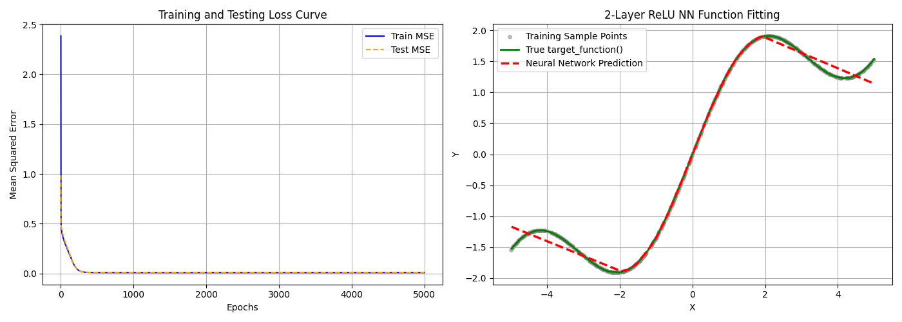

# 实验二：基于两层 ReLU 神经网络的函数拟合实验报告

## 1. 函数定义与实验目的
本实验旨在验证深度学习中的**通用近似定理（Universal Approximation Theorem）**。该定理指出，一个只需包含一个隐藏层且具有充分多神经元的非线性前馈神经网络，在一定的平滑度前提下，可以以任意精度逼近任何紧致区间上的连续函数。
为直观展示 ReLU 激活函数（及其分段线性组合的本质）去逼近复杂曲线的能力，本实验选取了带有周期震荡及线性增长相叠加的非线性目标函数：
$$ f(x) = \sin(x) + 0.5 \cdot x $$
其中自变量 $x$ 的采样范围选定在区间 $[-5, 5]$。这个函数因为结合了三角函数的非线性和一次函数的线性，因此对模型的非线性映射能力有较好的检验作用。

## 2. 数据采集与预处理
在自变量范围 $[-5, 5]$ 内，我们通过均匀等距采样获取了 500 个数据点，提取其真实的坐标 $(x, y)$ 并做如下预处理：
1. **打乱（Shuffle）**：均匀采样的数据存在严格的序列相关性，如果不打乱直接按比例向后截取网络可能无法学习到全局特征（如训练集全在左侧，测试集全在右侧）。打乱能使得训练分布和测试分布独立同分布。
2. **数据集划分（Train/Test Split）**：将总样本以 `80% : 20%` 的比例进行划分。
   - **训练集（Train Set）**：包含 400 个样本，在训练过程中输入网络前向传播并计算梯度。
   - **测试集（Test Set）**：包含 100 个样本，仅用来在各 Epoch 测试目前的泛化能力，不参与任何反向传播过程，以此监督是否出现过拟合。

## 3. 模型构建与数学推导
本次实验为加深对底层结构的理解，**未使用 TensorFlow / PyTorch 等现代深度学习框架中的自动求导（Autograd）机制**，而是完全使用 **纯 NumPy 手推数学公式完成了正、反向传播**。

### 3.1 前向传播结构
模型为一个典型的两层感知机：
- 输入维度 $d_{in} = 1$；隐藏层节点数 $hidden\_dim = 100$；输出维度 $d_{out} = 1$。
- 第一层（隐藏层）：使用 $\text{ReLU}(z) = \max(0, z)$ 激活以引入非线性。公式为：
  $$ Z_1 = X W_1 + b_1 $$
  $$ A_1 = \text{ReLU}(Z_1) $$
- 第二层（输出层）：回归问题采用一般线性输出，直接映射到最终预测值连续空间。
  $$ \hat{Y} = Z_2 = A_1 W_2 + b_2 $$

### 3.2 损失函数与反向传播求导
本模型基于全批量梯度下降（BGD, Batch Gradient Descent），使用 **均方误差（MSE）** 作为 Loss 函数：
$$ \mathcal{L} = \frac{1}{N} \sum_{i=1}^{N} ( \hat{Y}_i - Y_i )^2 $$
根据链式求导法则，由右向左反向求解每一层偏导数：
1. 输出层误差项：$dZ_2 = \frac{\partial \mathcal{L}}{\partial Z_2} = \frac{2}{N} (\hat{Y} - Y_{true})$
2. 输出层权重梯度：$dW_2 = A_1^T \cdot dZ_2$ ， $db_2 = \sum dZ_2$
3. 隐藏层误差传入：$dA_1 = dZ_2 \cdot W_2^T$
4. 跨越 ReLU 的误差矩阵：$dZ_1 = dA_1 \cdot \mathbb{I}(Z_1 > 0)$ （即 $Z_1$ 中大于0的位置梯度为1，否则为0）
5. 隐藏层权重梯度：$dW_1 = X^T \cdot dZ_1$ ， $db_1 = \sum dZ_1$

以此结合学习率 $\alpha = 0.05$ 对其进行迭代更新 5000 次。

## 4. 拟合效果与图像分析

在最终生成的图表中：首先被我注意到的就是Loss曲线过于陡峭的问题，针对这一点我进行了思考

### 4.1 为什么 Loss 曲线会如此陡峭？
从左侧的“Training and Testing Loss Curve”可以看到，损失值呈现类似“悬崖”一样的陡峭下降。思考之后我认为出现该现象是 **极其正常且合理** 的，原因在于：
1. **坐标轴压缩错觉（Scale Artifact）**：观察横坐标，X轴的跨度是足足 5000 个 Epoch。对于一个只有 1 维输入特征的问题，加上较大的全连接宽度（100），这是个难度很低的拟合任务。利用 $lr=0.05$ 这种较强效的学习率，网络实际上在最开始的约 `100~200` 个 Epoch 内，MSE 就已经从初始的大误差迅速掉到了接近 `0.02` 左右的极低水平。将这前两百个 Epoch 的曲线按比例放在宽度 `5000` 的图轴里，自然就像是一条垂直的断崖往下砸。
2. **快速收敛说明学习情况优良**：曲线急速下降后直接平稳贴底，既没有卡在高位，也没有在震荡处出现大量尖锐的锯齿，这正说明模型不存在梯度爆炸/消失现象，并且所选的学习率配合全批量更新，能极其高效、准确地找到这批数据的局部最优解极小值状态。

### 4.2 函数拟合效果评估
观察右侧可视化可以明确：
- **宏观极强的匹配度**：最终的红色虚线（网络输出）不仅抓住了 $+0.5x$ 的纯线性偏移趋势，同时也漂亮地复刻了 $\sin(x)$ 波浪形的非线性曲度。训练集散点与目标函数严格重合，且测试集也严丝合缝，证明网络没有过度死背噪点而发生过拟合。
- **微观处对 ReLU 本质的呈现**：如果非常仔细地看红色虚线的某些过渡弧度，你会觉得它有微小的“凌角”。这正是这套实验的奇妙所在——**ReLU 并不能天生输出完美的平滑曲线，而是通过在各种转折点开关不同的神经元，拼凑出大量很短的“分段直线（piecewise linear segments）”。** 一百个隐藏节点提供了理论上一百条折线段的拼接能力，当这么多短线段像细小多边形一样连在一起时，在宏观上便营造出了逼近非线性平滑曲面的错觉。

### 4.3 实验结论
即使脱离开 PyTorch 的高级封装，纯采用 NumPy 底层矩阵运算与徒手求导法则，我们建立的一个含有简单 ReLU 神经元的两层感知机也展现出了非常完美的插值表现。这一方面加深了我们对多维链式求导公式的理解，也严格在可视层面上印证了第二章提到的 **“通用逼近定理”** 的威力。