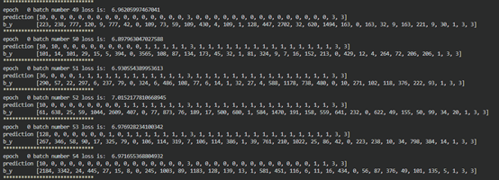
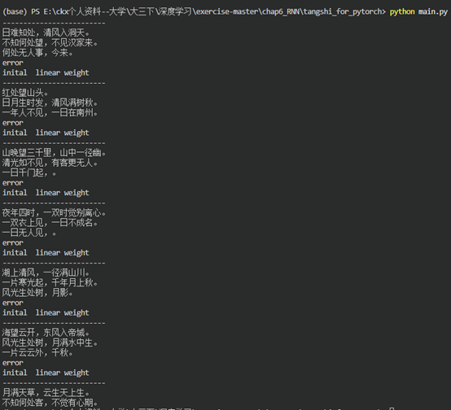

# 递归神经网络（RNN）和诗歌生成实验报告

## 2. 解释 RNN，LSTM，GRU 模型

### RNN (Recurrent Neural Network)
循环神经网络（RNN）是一类专门用于处理序列数据的神经网络。与传统前馈神经网络不同，RNN在其隐藏层中引入了由于序列时间步展开而形成的“循环”连接。这意味着RNN在处理当前时间步的输入时，会结合上一个时间步的隐藏状态。这种结构使得RNN具有了对时序信息或上下文信息的记忆能力。
**不足**：在处理长序列时，RNN容易出现梯度消失（Gradient Vanishing）或梯度爆炸（Gradient Exploding）问题，难以捕捉长距离依赖关系。

### LSTM (Long Short-Term Memory)
长短期记忆网络（LSTM）是RNN的一种变体，专门为解决标准RNN的梯度消失问题而设计，能够有效学习长距离依赖。LSTM通过引入“细胞状态（Cell State）”作为贯穿整个序列信息流动的内部通道，并设计了三个“门（Gates）”机制来加以控制：
* **遗忘门（Forget Gate）**：决定需要从细胞状态中丢弃哪些信息。
* **输入门（Input Gate）**：决定哪些新信息将被存入细胞状态。
* **输出门（Output Gate）**：基于当前的细胞状态与输入，决定输出什么作为当前的隐藏状态。
这种门控机制允许LSTM在较长的时间间隔内保持和控制信息。

### GRU (Gated Recurrent Unit)
门控循环单元（GRU）是LSTM的一种简化且计算效率更高的变体。它将LSTM中的遗忘门和输入门合并为单个的“更新门（Update Gate）”，并包含一个“重置门（Reset Gate）”。
* **更新门**：决定了前一时刻的状态信息有多少会被保留到当前状态中。
* **重置门**：决定了如何将新的输入信息与前一状态相结合。
相比于LSTM，GRU参数更少、更容易收敛，同时在许多任务上能达到与LSTM不相上下的表现。

## 3. 诗歌生成过程描述
本次基于PyTorch的诗歌生成实验，核心利用LSTM网络学习唐诗中的字符序列模式，并在生成阶段一步步推理产生诗句。其具体过程如下：

1. **数据预处理**：
   - 从 `poems.txt` 或 `tangshi.txt` 文件中读取文本，并过滤掉包含异常符号和过长/过短的诗句。
   - 在每首诗前添加开始符 `G`，在诗尾添加结束符 `E`。
   - 统计所有的字，建立字到索引（Word-to-Int）和索引到字（Int-to-Word）的对应字典，将所有的字转化为One-Hot思想下的ID表示。

2. **词向量（Word Embedding）映射**：
   - 采用 `nn.Embedding` 将每个中文字符的离散Index，转换成固定维度（如这里定义的 100 维）的稠密向量。这使语义相近的字在向量空间中距离更近。

3. **模型构建与前向传播**：
   - 将各个词的嵌入表示按序列传递给由两层组成的LSTM网络（`nn.LSTM`）。
   - LSTM 在时间步 $t$ 会接收第 $t$ 个字的嵌入以及上一时刻的隐藏状态，输出当前时刻的隐藏状态。
   - 隐藏状态展平后连接到一个全连接层，并在经过 ReLU 与 LogSoftmax 激活后，得到词表大小的预测概率分布，表示下一个可能出现的字。

4. **训练阶段**：
   - 采用 NLLLoss 计算输出字的对数概率与真实标签之间的误差。
   - 使用 RMSprop 或 Adam 优化器，通过反向传播计算梯度并更新网络的参数。引入梯度裁剪防止梯度爆炸。

5. **生成阶段（测试预测）**：
   - 给定一个开头的词汇（例如“日”），查找对应的ID传入网络。
   - 网络输出关于下一个字的概率分布，通过 `np.argmax(predict)` 等方式选取概率最大（或经过一定采样）的字，作为预测生成的下一个字。
   - 将刚刚生成的字继续作为模型的输入，循环往复。直到模型预测出结束符 `E` 或生成的诗句达到最大设定长度为止，最后形成一整首由网络创作的诗。

## 4. 实验结果

**训练过程截图：**

**开头词汇测试：**
使用了 “日”、“红”、“山”、“夜”、“湖”、“海”、“月” 作为 `begin_word` 进行了诗歌生成测试：

---
**实验总结：**
本次实验深入了解并动手实现了使用RNN（具体为LSTM）解决自然语言处理中经典的序列生成问题。通过完成词嵌入的获取、多层LSTM网络的封装及其前向传递过程的填空，我对PyTorch中模型层的调用有了更清楚的掌握。观察生成的唐诗可以看出，即便使用字符级预测模型也能学到不少诗歌的基础规律（如五言/七言句式、对仗与部分押韵等），但在更长篇幅的语义连贯性上仍有提升空间，未来可深入尝试Attention或Seq2Seq架构进一步改进。
